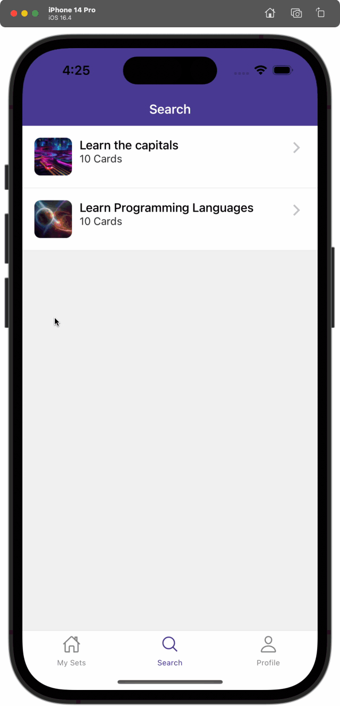
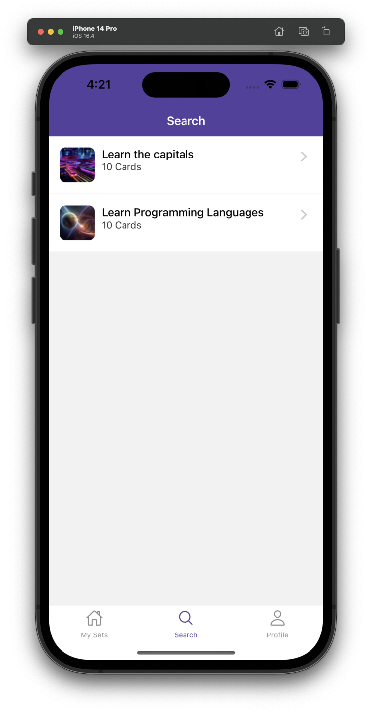
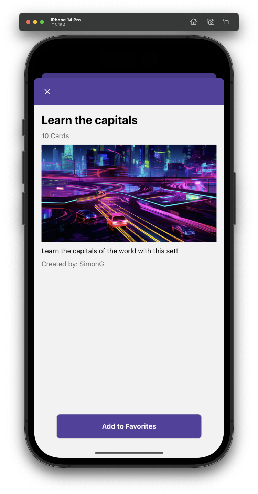
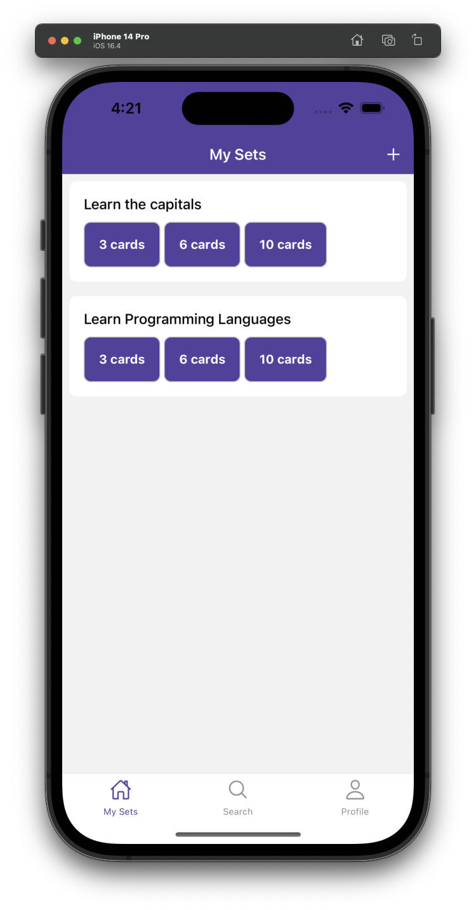
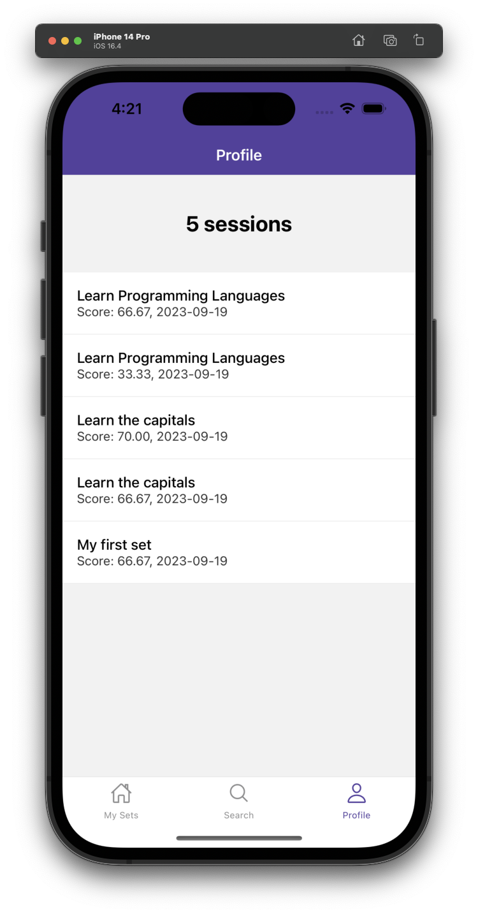

# React Native Anki Clone with API and Xata Database

This is a React Native Anki learning card clone with Expo Router and Express server using a [Xata database](https://xata.io/).

To run the project, check out the [Anki App](./ankiApp) and [Express API](./api) directories.

## Screenshots

